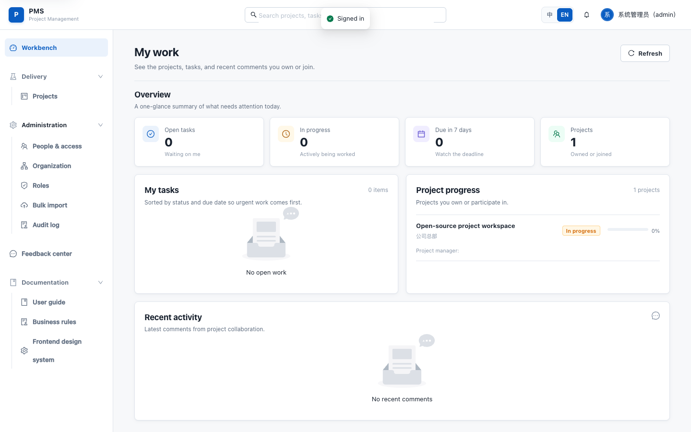
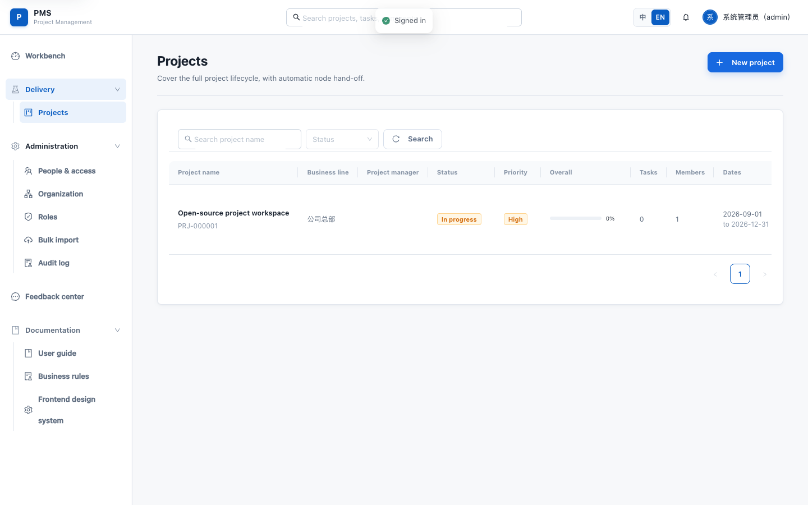
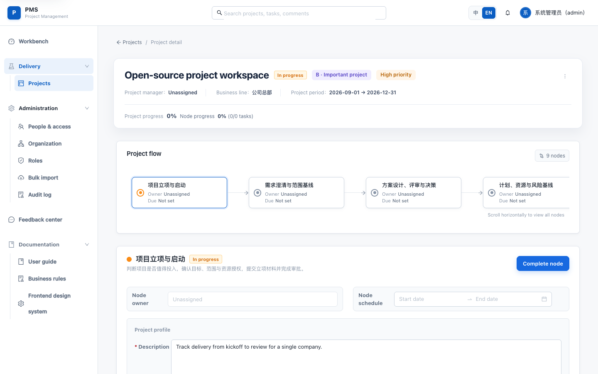
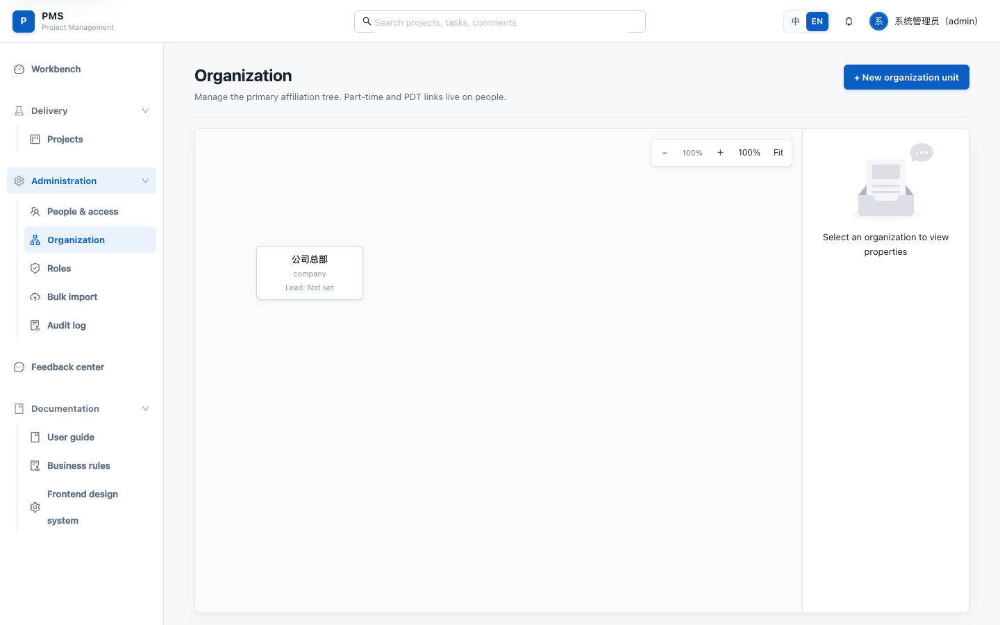
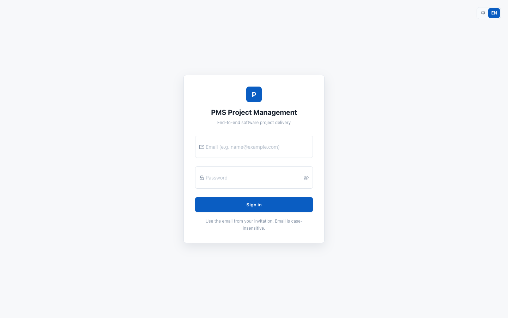

# PMS

面向**单个企业**的自部署项目管理系统。工作台、项目交付、组织与权限都在一个实例里完成。不是多租户 SaaS，也不拆微服务。

本仓库是安装入口，使用预构建镜像。本机不需要安装 Java、Maven、Node.js 或 pnpm。源码在 [`pms-backend`](https://github.com/xiebinJava/pms-backend) 和 [`pms-front`](https://github.com/xiebinJava/pms-front)。

[](https://github.com/xiebinJava/pms-distribution/releases)
[](https://github.com/xiebinJava/pms-distribution/actions/workflows/validate.yml)
[](LICENSE)

<p align="center">
  
</p>

<p align="center">
  
  
</p>

<p align="center">
  
  
</p>

<p align="center"><sub>截图来自隔离演示实例。界面为英文；流程节点名称仍按系统默认中文种子数据展示。</sub></p>

## 能做什么

| 模块 | 说明 |
| --- | --- |
| 工作台 | 汇总当前账号的任务、参与项目和最近评论，不是全公司总览 |
| 项目交付 | 固定节点流转（立项、需求范围、方案评审、计划与风险等），任务挂在节点上 |
| 组织与人员 | 主职组织树、角色权限、邀请开通、批量导入 |
| 协作与治理 | 评论、通知、反馈、审计日志 |
| 可选登录 | 默认使用本地密码，也可接入 LDAP / OIDC |

一个部署实例只服务一家企业，没有 `tenant_id`。

## 三步启动

需要 Docker Engine 或 Docker Desktop，以及 Compose v2。默认数据库是 **MySQL 8.4**，Docker 建议至少分配 **2 GiB** 内存。

```bash
git clone https://github.com/xiebinJava/pms-distribution.git
cd pms-distribution
./scripts/bootstrap.sh
```

打开 <http://localhost:5173>。首次空库会创建初始管理员：

| 项 | 值 |
| --- | --- |
| 登录邮箱 | `admin@example.com` |
| 密码 | `PmsAdmin123!` |

请立刻修改该密码。MySQL 与 JWT 等基础设施密钥仍由脚本随机生成，写入未被 Git 跟踪的 `.pms-bootstrap-secrets`。生产部署必须更换管理员密码（`validate-production-config.sh` 会拒绝上述默认值）。

当前发行版本：`1.0.6`。镜像在 GHCR，可匿名拉取。

如果改了 `PMS_PORT`，请把 `PMS_CORS_ALLOWED_ORIGINS` 和 `PMS_PUBLIC_BASE_URL` 改成同一端口。只改端口、不改 CORS 时，浏览器登录会被后端拒绝。`bootstrap.sh` 在端口已改、CORS 仍是示例值时，会自动对齐（见下方配置）。

## 常用命令

```bash
./scripts/status.sh
./scripts/logs.sh backend
./scripts/backup.sh
./scripts/upgrade.sh 1.0.1
```

脚本默认用仓库目录名作为 Compose 项目名（本仓库为 `pms-distribution`）。隔离环境请让每条命令使用同一组变量：

```bash
COMPOSE_PROJECT_NAME=pms-staging ENV_FILE=.env.staging COMPOSE_FILE=compose.yaml ./scripts/bootstrap.sh
COMPOSE_PROJECT_NAME=pms-staging ENV_FILE=.env.staging COMPOSE_FILE=compose.yaml ./scripts/status.sh
```

停止服务但保留数据：

```bash
docker compose --env-file .env -f compose.yaml down
```

不要使用 `down -v`，除非你明确要删除数据库和附件。

## 支持范围

| 项目 | 当前发行路径 |
| --- | --- |
| 容器运行时 | Docker Engine / Docker Desktop / Colima + Compose v2 |
| 数据库 | 仅 MySQL 8.4 |
| 前端入口 | Nginx 容器，默认 `5173` |
| 后端入口 | 仅容器网络可见，默认 `8080` |
| 生产 HTTPS | 由企业反向代理或 Ingress 负责 |

完整组合见 [支持矩阵](docs/operations/support-matrix.md)。

## 配置

首次启动前可以编辑 `.env`。敏感值只放在本地 `.env`、Docker secrets 或外部密钥管理器，不要提交到 Git。

改入口端口时，至少同步这三项：

```bash
PMS_PORT=5173
PMS_PUBLIC_BASE_URL=http://localhost:5173
PMS_CORS_ALLOWED_ORIGINS=http://localhost:5173,http://127.0.0.1:5173
```

`bootstrap.sh` 会在 `PMS_PORT` 不是 `5173`、且 CORS / 公网地址仍是示例值时，自动改成当前端口。

生产环境至少需要：

- `PMS_DEPLOYMENT_ENV=production`
- 由密钥管理器注入的 `PMS_JWT_SECRET`
- 非默认的数据库和管理员密码
- 正式域名、HTTPS 和受限的 `PMS_CORS_ALLOWED_ORIGINS`
- SMTP、对象存储、备份策略和监控告警

完整说明见 [生产配置](docs/operations/production.md)。

## 内存与本地开发的差别

使用 Docker Desktop 时，建议至少分配 **2 GiB** 内存。首次拉镜像和初始化 MySQL 可能要一两分钟。

启动脚本会在拉镜像前检查 Docker 内存。低于 `PMS_MIN_DOCKER_MEMORY_GIB`（默认 2 GiB）会直接提示并退出。已确认资源足够时，可在 `.env` 里调整该阈值。

本地开发能跑起来，不代表一台内存很小的机器一定能完成发行包冷启动：

- 本地开发可能已经有初始化过的数据卷
- 本地前后端可能跑在宿主机上，不和 MySQL 抢同一块虚拟机内存
- 发行包是全新冷启动，要同时拉起数据库、后端 Flyway 和前端
- Docker 内存还要分给引擎和其他容器

Colima 用户请给对应 profile 同样的内存，并把 Compose 工程放在 `$HOME` 下，以便虚拟机挂载。

## 仓库关系

```text
pms-distribution   安装、升级、备份、发行文档（你在这里）
pms-backend        Spring Boot API、迁移、后端镜像
pms-front          Vue / Nginx 前端和前端镜像
```

发行仓库只引用经过测试的镜像版本，避免复制源码造成版本漂移。

## 开发与发布

```bash
bash scripts/test-distribution-contract.sh
bash scripts/test-compose-config.sh
bash scripts/test-operations-safety.sh
./scripts/check-privacy.sh
bash -n scripts/*.sh docker/*.sh
git diff --check
```

发布顺序：源码仓库测试并发布镜像 → 更新本仓库 `PMS_VERSION` → 干净环境启动 / 升级 / 恢复 → 创建 Release。

## 文档

| 文档 | 说明 |
| --- | --- |
| [生产配置](docs/operations/production.md) | 上线前必须完成的安全与运行配置 |
| [升级](docs/operations/upgrade.md) | 备份、升级和失败回滚 |
| [备份与恢复](docs/operations/backup-restore.md) | 数据库与附件归档 |
| [故障排查](docs/operations/troubleshooting.md) | 常见启动、登录和迁移问题 |
| [支持矩阵](docs/operations/support-matrix.md) | 当前支持与不支持的组合 |
| [发布镜像](docs/operations/release-images.md) | GHCR 发布顺序与校验 |
| [干净环境冒烟验收](docs/operations/clean-machine-smoke-test.md) | 发布前必过清单 |
| [发行镜像归因](docs/operations/image-attribution.md) | 第三方镜像来源 |
| [变更记录](CHANGELOG.md) | 版本变更 |
| [贡献指南](CONTRIBUTING.md) | 如何提交改动 |
| [安全策略](SECURITY.md) | 漏洞私下报告 |

问题跟踪用 Issues，使用讨论用 [Discussions](https://github.com/xiebinJava/pms-distribution/discussions)。

## 许可证

Apache-2.0，详见 [LICENSE](LICENSE) 和 [NOTICE](NOTICE)。第三方镜像和依赖仍受其各自许可证约束。
